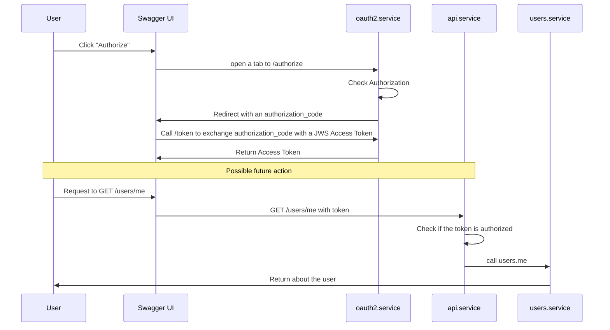

This is an example project

It's currently in progress .

To start :
```
npm start
```

it will start an web UI on http://localhost:3000 (can change depending on your configuration)

Feel free to navigate on the openapi ui : http://localhost:3000/openapi/ui
and check the linked code


Here are some things you can see on this example :
 - `hidden.secret` is a hidden action that will not be included in the openapi (`openapi:false`) but available on moleculer-web : `curl --location "http://localhost:3000/hidden/secret?name=toto"`
 - `users.upload_avatar` is an example of stream upload
 - `pets.upload_image` is an example of multipart upload with params
 - `pets.update/get/list/create/delete` is an example of crud "manual"
 - `users.update/get/list/create/delete` is an example of crud "automatic" with `REST users`
 - `api` service hold the configuration with an authorization example based on the security needed by the openapi
 - `oauth2` server to show how the Oauth2 works on openapi


## OAuth2 service
the OAuth2 service is the service that will handle the OAuth2.0 process .

It will also try to generate rsa keys to sign the JWS, with a public key to check the signature .

